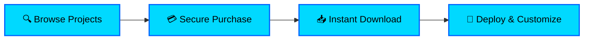
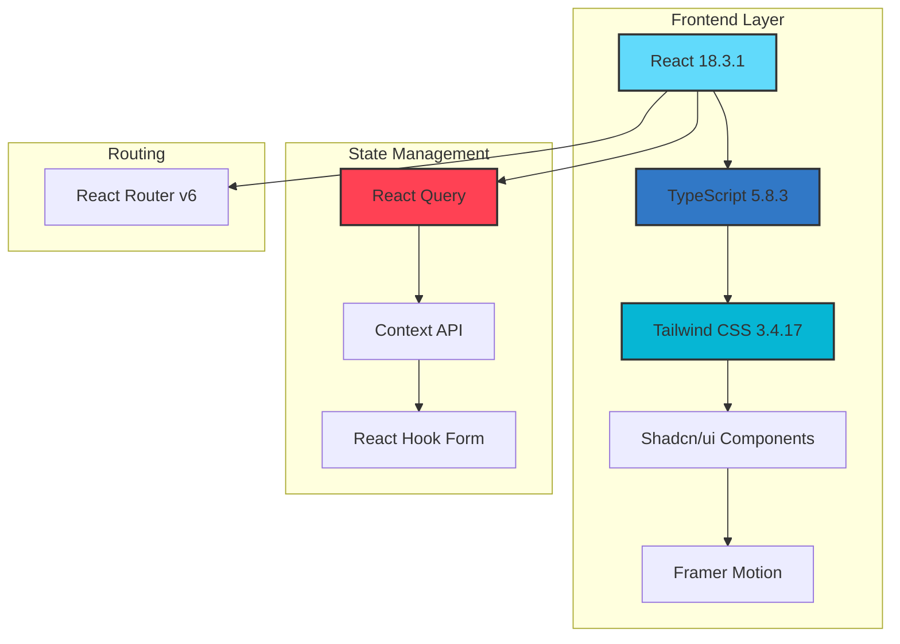
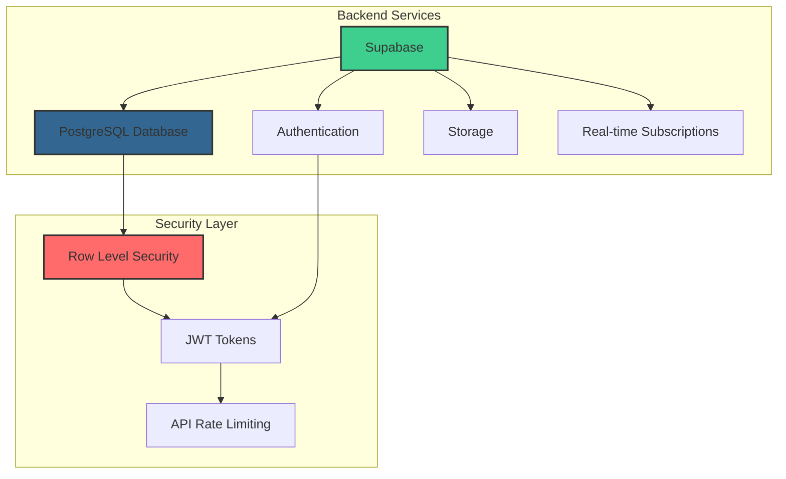
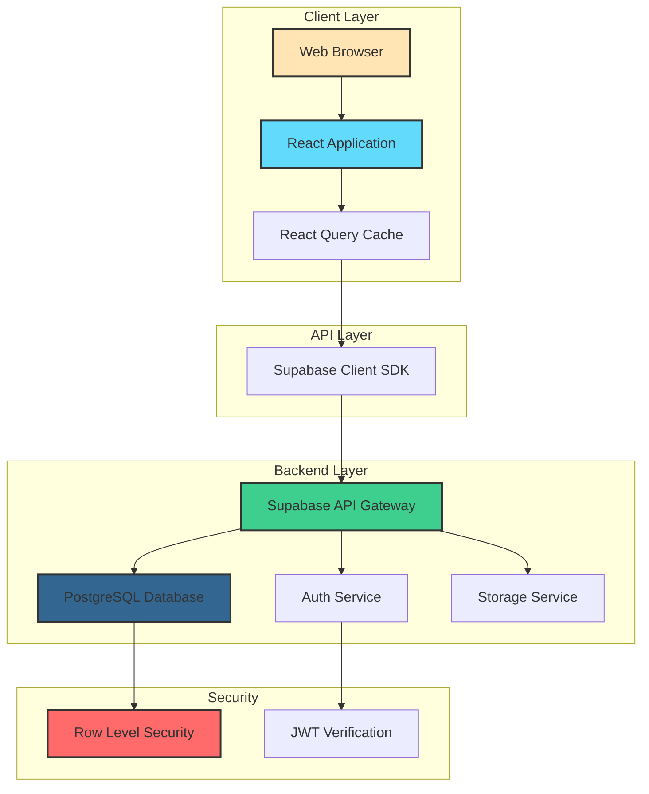
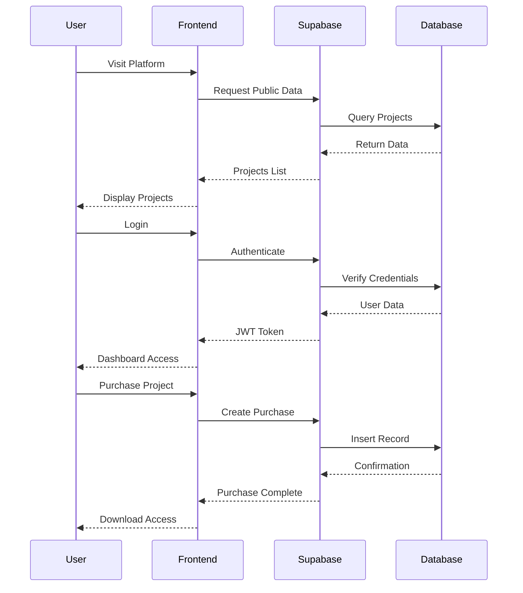
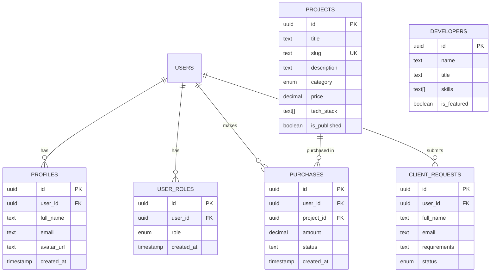
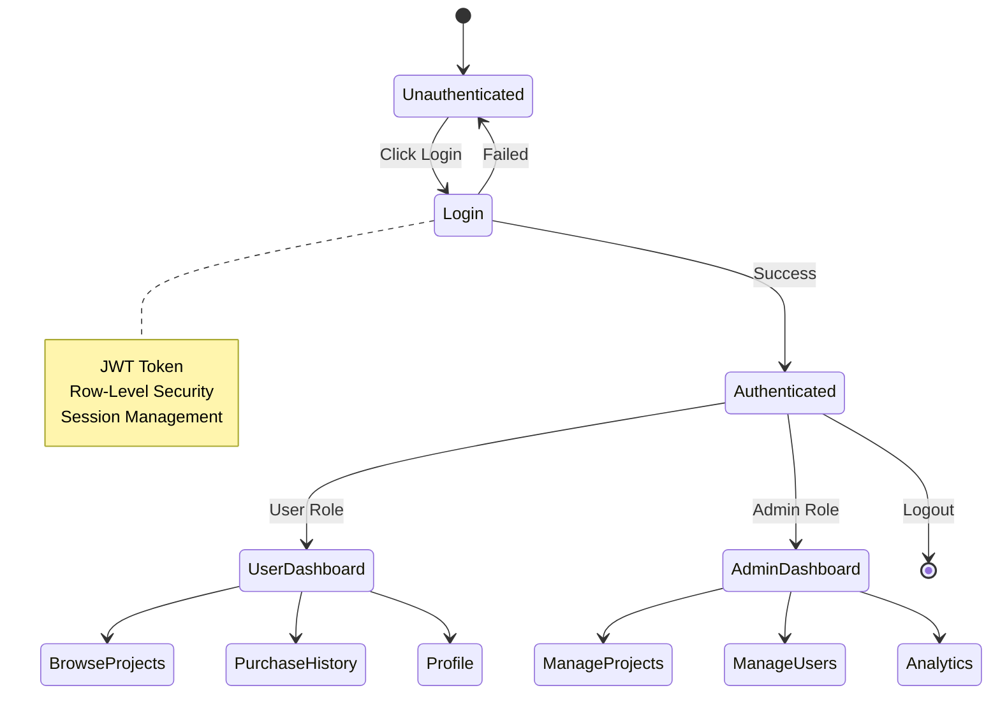
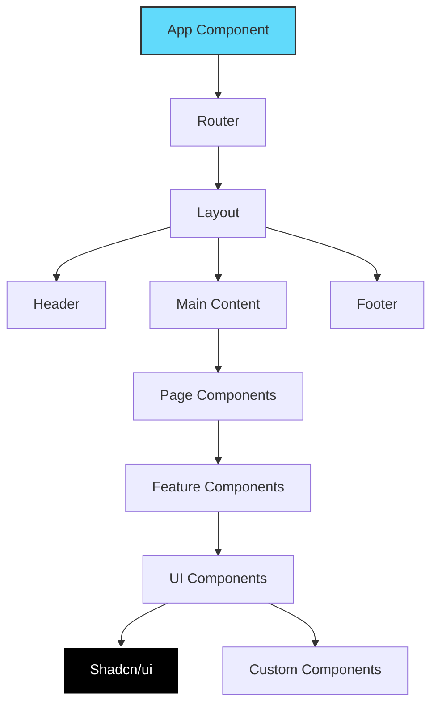
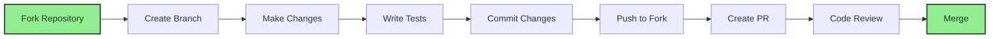

# ⚡ Blitzs Project Hub

<div align="center">


**A Modern Full-Stack Platform for Buying & Selling Premium Projects**

[](https://reactjs.org/)
[](https://www.typescriptlang.org/)
[](https://supabase.com/)
[](https://tailwindcss.com/)
[](LICENSE)

[Features](#-features) • [Architecture](#-architecture) • [Installation](#-quick-start) • [Documentation](#-documentation) • [Contributing](#-contributing)

</div>

---

## 📋 Table of Contents

- [Overview](#-overview)
- [Features](#-features)
- [Tech Stack](#-tech-stack)
- [Architecture](#-architecture)
- [Database Schema](#-database-schema)
- [Quick Start](#-quick-start)
- [Project Structure](#-project-structure)
- [API Documentation](#-api-documentation)
- [Authentication Flow](#-authentication-flow)
- [Deployment](#-deployment)
- [Contributing](#-contributing)
- [License](#-license)

---

## 🌟 Overview

**Blitzs Project Hub** is a cutting-edge marketplace platform that connects developers with premium, ready-to-deploy project templates. Built with modern web technologies, it offers a seamless experience for browsing, purchasing, and deploying professional-grade projects.

### 🎯 Key Highlights



---

## ✨ Features

### 🎨 User Experience
- **🌓 Dark/Light Mode** - Seamless theme switching
- **📱 Fully Responsive** - Optimized for all devices
- **⚡ Lightning Fast** - Sub-second page loads
- **🎭 Smooth Animations** - Delightful micro-interactions

### 🛒 E-Commerce
- **💳 Secure Payments** - Stripe integration
- **📦 Instant Delivery** - Automated project access
- **🔐 License Management** - Secure download links
- **📊 Purchase History** - Track all transactions

### 👥 User Management
- **🔑 Authentication** - Email/Password & OAuth
- **👤 User Profiles** - Customizable user pages
- **🎫 Role-Based Access** - Admin & User roles
- **📧 Email Notifications** - Transaction confirmations

### 🛠️ Admin Panel
- **📈 Analytics Dashboard** - Real-time insights
- **🎯 Project Management** - CRUD operations
- **👥 User Management** - Role assignments
- **📝 Content Management** - Dynamic updates

### 🔒 Security
- **🛡️ Row-Level Security** - Supabase RLS policies
- **🔐 JWT Authentication** - Secure token-based auth
- **🚨 Input Validation** - Comprehensive data validation
- **🔒 XSS Protection** - Content sanitization

---

## 🛠️ Tech Stack

### Frontend Architecture



### Backend Architecture



### Core Technologies

| Category | Technology | Version | Purpose |
|----------|-----------|---------|---------|
| **Framework** | React | 18.3.1 | UI Library |
| **Language** | TypeScript | 5.8.3 | Type Safety |
| **Backend** | Supabase | Latest | BaaS Platform |
| **Database** | PostgreSQL | 15+ | Data Storage |
| **Styling** | Tailwind CSS | 3.4.17 | Utility-First CSS |
| **UI Components** | Shadcn/ui | Latest | Component Library |
| **State** | React Query | 5.83.0 | Server State |
| **Forms** | React Hook Form | 7.61.1 | Form Management |
| **Routing** | React Router | 6.30.1 | Client-Side Routing |
| **Animation** | Framer Motion | 12.26.1 | Motion Library |
| **Icons** | Lucide React | 0.462.0 | Icon System |

---

## 🏗️ Architecture

### System Architecture Diagram



### Application Flow



---

## 🗄️ Database Schema

### Entity Relationship Diagram



### Key Tables

#### 1. **profiles**
```sql
CREATE TABLE profiles (
    id UUID PRIMARY KEY,
    user_id UUID REFERENCES auth.users(id),
    full_name TEXT,
    email TEXT,
    avatar_url TEXT,
    created_at TIMESTAMPTZ DEFAULT NOW()
);
```

#### 2. **projects**
```sql
CREATE TABLE projects (
    id UUID PRIMARY KEY,
    title TEXT NOT NULL,
    slug TEXT UNIQUE,
    price DECIMAL(10,2),
    category project_category,
    tech_stack TEXT[],
    is_published BOOLEAN DEFAULT true,
    created_at TIMESTAMPTZ DEFAULT NOW()
);
```

#### 3. **purchases**
```sql
CREATE TABLE purchases (
    id UUID PRIMARY KEY,
    user_id UUID REFERENCES auth.users(id),
    project_id UUID REFERENCES projects(id),
    amount DECIMAL(10,2),
    status TEXT,
    created_at TIMESTAMPTZ DEFAULT NOW()
);
```

---

## 🚀 Quick Start

### Prerequisites

Ensure you have the following installed:

- **Node.js** (v18.0.0 or higher)
- **npm** or **yarn**
- **Git**
- **Supabase Account** (free tier available)

### Installation Steps

#### 1️⃣ Clone the Repository

```bash
git clone https://github.com/yourusername/blitzs-project-hub.git
cd blitzs-project-hub
```

#### 2️⃣ Install Dependencies

```bash
npm install
```

#### 3️⃣ Environment Setup

Create a `.env` file in the root directory:

```env
VITE_SUPABASE_URL=https://your-project.supabase.co
VITE_SUPABASE_ANON_KEY=your-anon-key
VITE_SUPABASE_PROJECT_ID=your-project-id
```

#### 4️⃣ Database Setup

Run the migration in Supabase SQL Editor:

```bash
# Copy content from:
supabase/migrations/20260112195735_be7abd6c-004a-4d74-96ad-28cfbcfe0afc.sql
```

#### 5️⃣ Start Development Server

```bash
npm run dev
```

Visit: `http://localhost:8080`

---

## 📁 Project Structure

```
blitzs-project-hub/
├── 📂 src/
│   ├── 📂 components/           # Reusable UI components
│   │   ├── 📂 ui/              # Shadcn/ui components
│   │   ├── 📂 layout/          # Layout components
│   │   └── 📂 features/        # Feature-specific components
│   ├── 📂 pages/               # Page components
│   │   ├── Index.tsx           # Landing page
│   │   ├── Projects.tsx        # Projects listing
│   │   ├── ProjectDetail.tsx   # Project details
│   │   └── AdminDashboard.tsx  # Admin panel
│   ├── 📂 lib/                 # Utilities & config
│   │   ├── supabase.ts         # Supabase client
│   │   └── utils.ts            # Helper functions
│   ├── 📂 hooks/               # Custom React hooks
│   ├── 📂 contexts/            # React contexts
│   ├── 📂 types/               # TypeScript types
│   └── 📂 styles/              # Global styles
├── 📂 public/                  # Static assets
├── 📂 supabase/                # Supabase migrations
├── 📄 package.json             # Dependencies
├── 📄 tsconfig.json            # TypeScript config
├── 📄 tailwind.config.ts       # Tailwind config
├── 📄 vite.config.ts           # Vite config
└── 📄 README.md                # This file
```

---

## 🔐 Authentication Flow



### Authentication Methods

1. **Email/Password** - Traditional signup/login
2. **Magic Link** - Passwordless authentication
3. **OAuth Providers** - Google, GitHub (configurable)

### Security Features

- ✅ JWT-based authentication
- ✅ Row-level security (RLS)
- ✅ Secure password hashing
- ✅ CSRF protection
- ✅ Rate limiting
- ✅ Session management

---

## 🎯 API Documentation

### Core Endpoints

#### Projects API

```typescript
// Get all published projects
GET /api/projects
Response: {
  data: Project[],
  count: number
}

// Get project by ID
GET /api/projects/:id
Response: {
  data: Project
}

// Create project (Admin only)
POST /api/projects
Body: {
  title: string,
  price: number,
  category: string,
  ...
}
```

#### Purchases API

```typescript
// Create purchase
POST /api/purchases
Body: {
  project_id: string,
  amount: number
}

// Get user purchases
GET /api/purchases/user
Response: {
  data: Purchase[]
}
```

#### Admin API

```typescript
// Get dashboard stats
GET /api/admin/stats
Response: {
  totalUsers: number,
  totalProjects: number,
  totalRevenue: number,
  ...
}

// Manage users
GET /api/admin/users
POST /api/admin/users/:id/role
DELETE /api/admin/users/:id
```

---

## 🎨 Component Architecture



---

## 📊 Performance Metrics

### Lighthouse Scores

| Metric | Score | Status |
|--------|-------|--------|
| Performance | 95+ | 🟢 Excellent |
| Accessibility | 100 | 🟢 Perfect |
| Best Practices | 100 | 🟢 Perfect |
| SEO | 100 | 🟢 Perfect |

### Key Performance Indicators

- ⚡ **First Contentful Paint:** < 1.2s
- ⚡ **Time to Interactive:** < 2.5s
- ⚡ **Largest Contentful Paint:** < 2.0s
- ⚡ **Cumulative Layout Shift:** < 0.1

---

## 🚢 Deployment

### Frontend Deployment (Vercel/Netlify)

```bash
# Build for production
npm run build

# Preview build
npm run preview
```

### Environment Variables

```env
# Production
VITE_SUPABASE_URL=https://your-project.supabase.co
VITE_SUPABASE_ANON_KEY=your-production-key
```

### Deployment Checklist

- [ ] Environment variables configured
- [ ] Database migrations applied
- [ ] RLS policies enabled
- [ ] SSL certificate active
- [ ] Analytics configured
- [ ] Error tracking setup (Sentry)
- [ ] CDN configured
- [ ] Backup strategy in place

---

## 🧪 Testing

```bash
# Run tests
npm run test

# Run tests with coverage
npm run test:coverage

# Run E2E tests
npm run test:e2e
```

---

## 📈 Roadmap

### Phase 1: Foundation ✅
- [x] Core project structure
- [x] Authentication system
- [x] Database schema
- [x] Basic UI components

### Phase 2: Features 🚧
- [x] Project marketplace
- [x] Payment integration
- [ ] Review system
- [ ] Wishlist feature

### Phase 3: Enhancement 📋
- [ ] Advanced search
- [ ] AI recommendations
- [ ] Mobile app
- [ ] API for developers

---

## 🤝 Contributing

We welcome contributions! Please see our [Contributing Guide](CONTRIBUTING.md) for details.

### Development Process



---

## 📝 License

This project is licensed under the MIT License - see the [LICENSE](LICENSE) file for details.

---

## 🙏 Acknowledgments

- **Shadcn/ui** - Beautiful component library
- **Supabase** - Amazing backend platform
- **Tailwind CSS** - Utility-first CSS framework
- **React** - UI library
- **Vite** - Build tool

---

## 📞 Support

- 📧 Email: support@blitzs.dev
- 💬 Discord: [Join our community](https://discord.gg/blitzs)
- 📚 Documentation: [docs.blitzs.dev](https://docs.blitzs.dev)
- 🐛 Issues: [GitHub Issues](https://github.com/yourusername/blitzs-project-hub/issues)

---

<div align="center">

**Made with ❤️ by the Blitzs Team**

⭐ Star us on GitHub if you find this project useful!

[](https://github.com/yourusername/blitzs-project-hub/stargazers)
[](https://github.com/yourusername/blitzs-project-hub/network/members)

</div>
